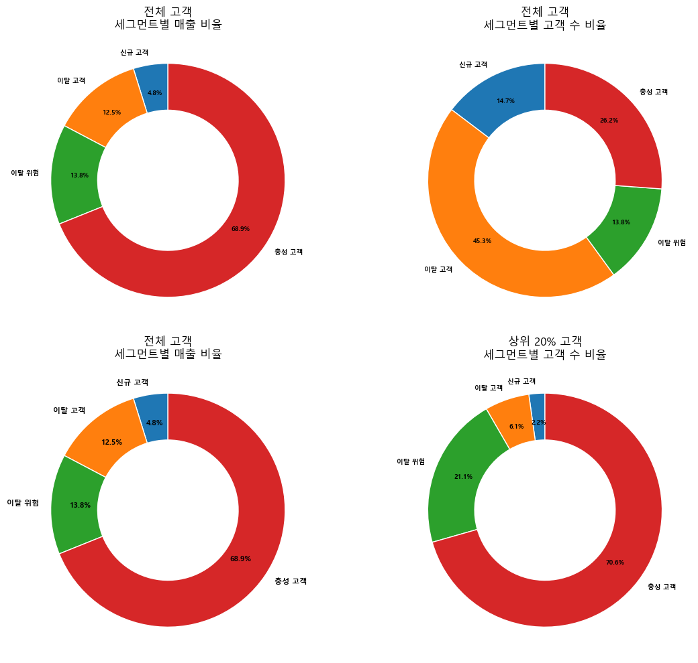
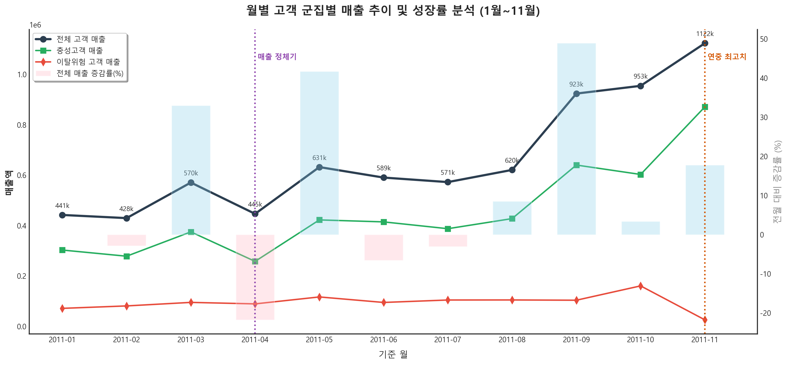

# UK 온라인 리테일 고객 세그먼트 분석

온라인 리테일 거래 데이터를 기반으로 고객 가치를 세분화하고, 실제 마케팅 예산을 어디에 집중해야 하는지 정리한 CRM 분석 프로젝트입니다.  
핵심은 `고객 분류` 자체보다 `누구에게 먼저 액션해야 하는가`를 데이터로 설명한 점입니다.

## 바로 보는 결과





## 세그먼트별 캠페인 시뮬레이션

RFM 세그먼트는 분류 결과로 끝내지 않고, `누구에게 어떤 캠페인을 어떤 목표로 집행할지`까지 번역해야 의미가 있습니다. 이 프로젝트를 실무 관점으로 옮기면, 충성 고객에게는 유지와 업셀, 이탈위험 고객에게는 재활성화, 일반 고객에게는 구매 빈도 상승, 저가치 고객에게는 저비용 자동화 nurture를 설계하는 문제와 같습니다.

| 세그먼트 | 캠페인 목표 | 예시 액션 | 우선 채널 | 확인할 KPI |
|------|------|------|------|------|
| 충성 고객 | 유지 + 객단가 확대 | 신상품 선공개, 묶음 제안, VIP 감사 캠페인 | Email, 앱 푸시 | 재구매율, ARPU, 객단가 |
| 이탈위험 고객 | 재활성화 | 한시 쿠폰, 재방문 유도 메시지, 장바구니 리마인드 | Email, SMS | 재활성화율, 30일 매출 회복 |
| 일반 고객 | 구매 빈도 상승 | 기간 한정 프로모션, 교차판매 추천 | Email, 웹 배너 | 구매 빈도, 전환율 |
| 저가치/휴면 고객 | 비용 통제형 유지 | 자동화 뉴스레터, 저비용 리마인드 캠페인 | Email | 오픈율, 저비용 전환 |

## 프로젝트 한눈에 보기

| 항목 | 내용 |
|------|------|
| 도메인 | CRM / 고객 세그먼트 분석 |
| 진행 형태 | 4인 팀 프로젝트 |
| 문제 정의 | 한정된 마케팅 자원을 어떤 고객군에 집중해야 매출과 재구매 효율이 높아지는가 |
| 핵심 방법 | RFM 기반 세그먼트 설계, 파레토 검증, 통계 검정, 시각화 |
| 주요 도구 | Python, Pandas, NumPy, SciPy, statsmodels, Matplotlib, Seaborn, Jupyter |
| 핵심 결과 | 상위 20% 고객이 전체 매출의 73.5%를 차지하고, 상위 고객군 내부에서도 충성 고객과 이탈위험 고객에 집중하는 전략이 유효함을 확인 |

## 팀 프로젝트 공개 정리 기준

이 저장소는 4인 팀 프로젝트 결과를 공개 저장소 기준으로 다시 정리한 버전입니다.  
개별 기여를 과장하기보다, 이 프로젝트에서 실제로 읽히길 원하는 contribution signal을 아래 네 가지에 맞춰 정리했습니다.

- RFM을 그대로 쓰지 않고 `Monetary를 결과 변수로 분리`해 순환 논리를 피한 세그먼트 설계
- 파레토 분석과 ANOVA/Kruskal-Wallis를 함께 두어 `세그먼트 해석의 타당성`을 검증한 점
- 세그먼트 분류를 끝으로 두지 않고 `유지 / 재활성화 / 빈도 상승` 액션 시나리오로 번역한 점
- 노트북 중심 작업도 `README + 문서 + run_pipeline.py` 기준으로 다시 읽히게 정리한 점

## 이 프로젝트가 해결한 질문

- 고객 가치가 실제로 소수 고객에게 집중되어 있는가
- 고객을 어떤 기준으로 나눠야 운영 가능한 세그먼트가 되는가
- 매출 기여도가 높은 고객군 중에서 유지 대상과 재활성화 대상을 어떻게 구분할 것인가

## 접근 방식

1. 취소 주문, 반품, 비정상 StockCode 등 분석 노이즈를 제거해 회원 고객 기준 데이터셋을 만들었습니다.
2. RFM 중 Monetary를 결과 해석 변수로 두고, Recency와 Frequency 중심으로 세그먼트를 설계해 순환 논리를 피했습니다.
3. 파레토 구조를 검증하고, 세그먼트별 매출 차이가 우연이 아닌지 ANOVA와 Kruskal-Wallis로 확인했습니다.
4. 월별 매출, ARPU, 요일/시간대 패턴을 시각화해 마케팅 실행 포인트까지 연결했습니다.

## 핵심 결과

- 상위 20% 고객이 전체 매출의 `73.5%`를 차지했습니다.
- 상위 20% 고객 내부에서 `충성 고객 + 이탈위험 고객`이 매출의 `95.7%`를 차지했습니다.
- 이탈위험 고객군은 10월 대비 11월 매출이 `-84.2%` 감소해 재구매 유도 대상임을 확인했습니다.
- 세그먼트 간 매출 차이는 통계적으로 유의했으며, 단순 감각적 분류가 아니라 데이터 기반 구분임을 검증했습니다.

## 이 저장소에서 보여주려는 역량

- 고객 데이터를 비즈니스 의사결정 문제로 번역하는 능력
- 단순 시각화가 아니라 통계 검정까지 포함한 분석 설계
- 세그먼트 결과를 실제 액션 전략으로 연결하는 해석력
- 노트북 중심 프로젝트라도 재현 가능한 흐름으로 정리하는 문서화 습관

## 폴더 구조

| 경로 | 설명 |
|------|------|
| `분석 과정/` | 전처리, RFM 분석, 통계 검정, 시각화 노트북 |
| `데이터셋/` | 원본 CSV와 전처리 대상 데이터 위치 |
| `리테일_시각화_png/` | 결과 시각화 이미지 |
| `docs/` | 요약 문서 |
| `run_pipeline.py` | 원본 노트북을 수정하지 않고 전체 실행 흐름을 재현하는 진입점 |

## 한 줄 재현

원본 노트북 순서를 그대로 따라가도 되지만, GitHub 검토나 로컬 재현용으로는 아래 명령 하나로 전체 흐름을 실행할 수 있습니다.

```bash
python run_pipeline.py --clear-artifacts --stop-on-error
```

- `run_pipeline.py`는 원본 노트북을 수정하지 않고 실행본과 로그를 `artifacts/`에 저장합니다.
- 자세한 옵션과 저장소 정리 기준은 [AUTOMATION_GUIDE.md](./AUTOMATION_GUIDE.md)에서 확인할 수 있습니다.

## 노트북 기준 실행 방법

1. `pip install -r requirements.txt`
2. [UCI Online Retail](https://archive.ics.uci.edu/dataset/352/online+retail) 데이터를 내려받아 `데이터셋/Online_Retail.csv`에 저장
3. `분석 과정/`에서 아래 순서대로 노트북 실행

```bash
00_전처리_코드정리.ipynb
01_분석_RFM_코드정리.ipynb
02_통계검정_코드정리.ipynb
03_시각화_코드정리.ipynb
```

## 공개 저장소 기준 한계

- 데이터가 UK 단일 리테일 사례라 다른 업종이나 최근 기간에 그대로 일반화하기는 어렵습니다.
- 세그먼트 경계값은 비즈니스 상황에 따라 다시 조정할 수 있습니다.
- 실무 운영 데이터가 아닌 공개 데이터셋 기반 프로젝트이므로 실제 CRM 시스템 연결 범위는 포함하지 않습니다.
- 저장소의 코드와 문서는 [MIT License](./LICENSE)를 따르며, 원본 UCI 데이터셋은 제공처 정책을 따릅니다.

## 참고 문서

- [한 페이지 요약](./docs/한페이지_요약.md)
- [문서 인덱스](./docs/README.md)
- [발표 자료 가이드](./docs/PPT_Retail.md)
- [자동 실행 가이드](./AUTOMATION_GUIDE.md)
- [라이선스](./LICENSE)
